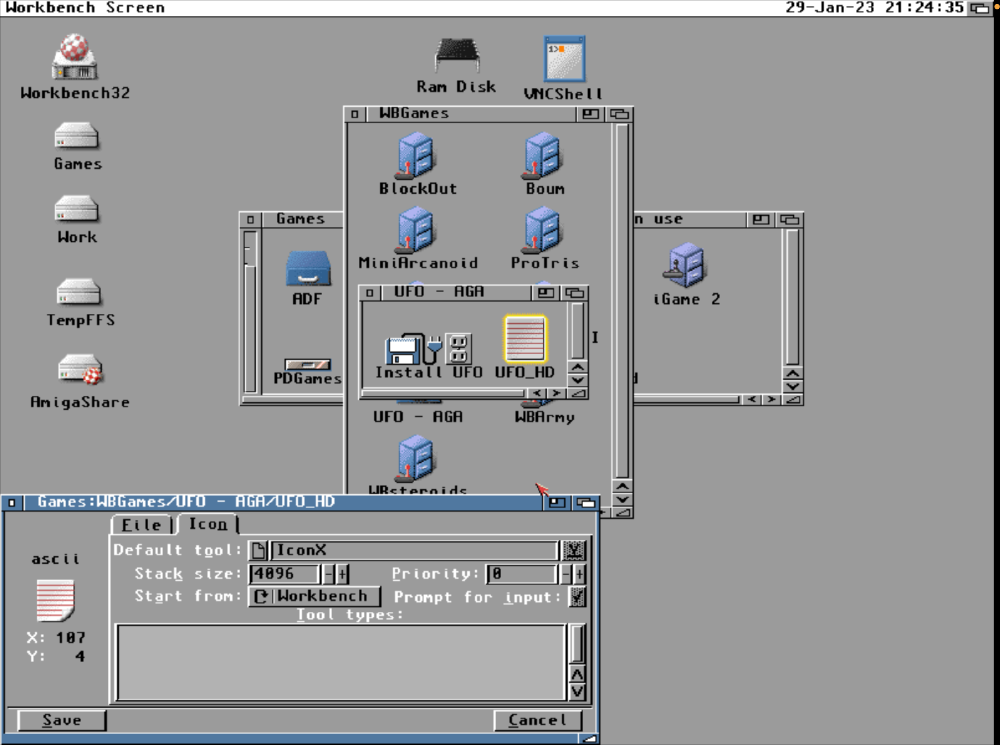

# They have come, and they are not friendly

One of the best game ever made is UFO: Enemy Unknown, a.k.a. XCOM / Ufo Defense. I have been (re)playing it a lot over the years but i always used the MS-DOS version (while our l0ve for Amiga is the strongest we at marrani are multiplatform retrogamers. Resistence is futile! All your pixels belong to us!). This time i decided to try the Amiga/AGA version which i knew to be slower compared to the MSDOS version since it's in 256 colors and the AGA chipset is not really known for speed, especially with an os friendly game (banging the chipset is faster, mkay?).

This version has some shortcomings, especially in land combat phase:

- No night, makes the game quite easier. Im not sure why they didn't include it. Space ? Too many floppies ? (its not like they darkened every tile at runtime at will, so they would probably need to include all them tiles)

- No music, why? Same problem ? 

- No fire/smoke animations (like after something burns down)

- No faster walking settings, whyyyyyyy ? Because of AGA slowness?

and some bugs, but no crashes - yet - though. While MSDOS version has crashed to me even producing non playable "it will always crash when event x occurs" saves.

But also some nices:

- Different but beautiful world view stage music

- Yes, os friendly games are slower.. buuuut it's nice to have it running in its own swappable/draggable screen. It's a multitasking OS, 'kay?

Other than that the game is exactly the same (it does even split the land combat in another executable like MSDOS version) and it's much fun. Been playing it on FS-UAE with a speedy 68040 non JIT configuration (no JIT yet for ARM64) with my supa AmigaOS 3.2.1 16GiB RDB hard disk image.

On a real Amiga 1200, with a 68030, the game is still very playable, speed is quite OK, altough i remember (haven't tried lately so don't take my word for it) it being real slow on a base A1200 without fastram (makes kinda sense).

Unfortunately the installation script for Amiga Installer doesn't work on never AmigaOS but you can make the game work nicely by coping all floppies in a directory (copy all from shell is enough) and then creating an icon for UFO_HD script and finally by assigning IconX as default tool, like 'dat:

# Fun hacky notes

Since UFO is a wb game using OS calls to draw it seemed fun to me to try accelerate it with FBlit. FBlit is a little utility to allow fast CPUs to substitute the Blitter in drawing because the Blitter is one of the components that C= [phuck you old C= :(] never updated so later CPUs are quite much faster in drawing in every aspect. I've been trying this on my real A1200 but to no avail.

Sooo, i rebooted and tried to load the game with 'boot without startup sequence' in Early boot menu, lauched the game which complained it couldn't find any suitable screenmode. Makes sense. It's SetPatch which enables AGA screenmodes (game needs an 8 bitplane screen) and i didn't run it. So, launched SetPatch and the game indeed started. 

The game looks for suitable screenmodes to open its screen: it looks for a 320x200 mode preferring NTSC 320x200 (the one which NTSC monitor file adds to the system if you have a PAL Amiga) but it can also use DBLNTSC if NTSC is not available (had it using even EURO36 in FS-UAE), falling back to PAL if none of the above is found but with PAL you will have a 56 pixel high black lower part of the screen because the game is really 320x200 anyway. Fortunately since ECS chipset was made screenmodes are configurable so it matters less if your system is PAL or NTSC (the only difference is how the system chooses its first screenmode at boot time). In my case i have a BenQ BL912 which can sync, provided you use VGAOnly too in devs/monitors (VGAOnly augments a bit horizontal and vertical refresh rates to be more compatible with later VGA monitors), any resolution/monitor file AmigaOS 3.x provides so i can run the game in NTSC without any black border (well, only with default black borders since the game is not overscan).

Soooo, launched FBlit from limited startup sequence and UFO worked. Why didn't it work with my full startup sequence ? Seems it didn't work because of some changes in default FBlit configuration (i have an hunch that if you use FBlitGUI and save the default configuration this configuration is different from FBlit's internal default configuration). Having deleted FBlit.cfg from ENV: the game started fine. 

On emulated 68040 with FS-UAE (140K dhrystone in SysInfo) the game is indeed much smoother than without using FBlit which is really nice.

Can't really wait to try it on my true 68060.

