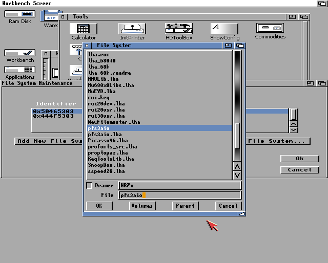
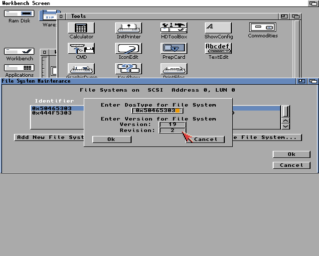
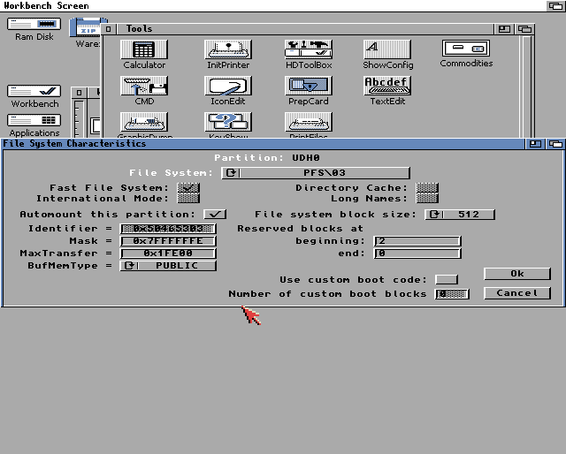

## PFS

[PFS3 All-In-One][pfs-aio], the best Amiga filesystem to date.  
[Aminet][aminet]: [disk/misc/pfs3aio.lha][pfs-aminet]

### `HDToolbox` Icon settings

Insert a new filesystem using the menu

Set the right filesystem ID:

    0x50465303

Setup a new partition with the right buffer size (we should have plenty of fast ram, no need to go small):

- Buffers: `300`

- MaxTransfer: `0x1FE00` (apparently only useful for for Amiga 600/1200 IDE controllers)



[aminet]: https://aminet.net
[pfs-aminet]: http://aminet.net/package/disk/misc/pfs3aio
[pfs-aio]: https://github.com/tonioni/pfs3aio
