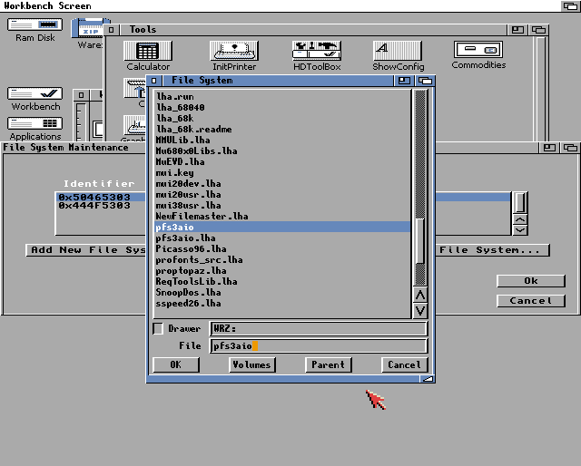
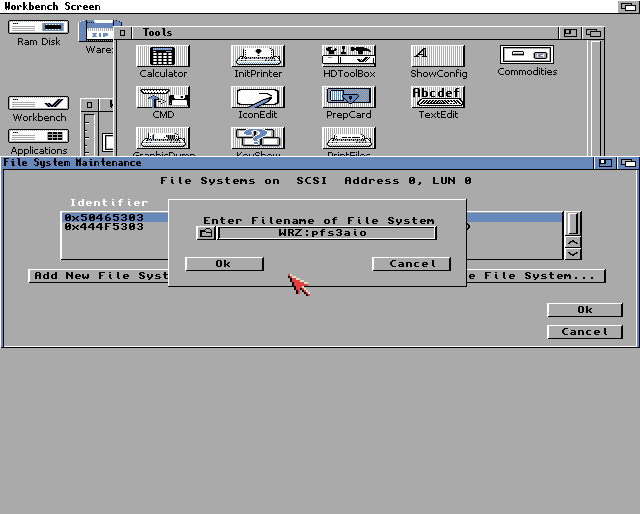
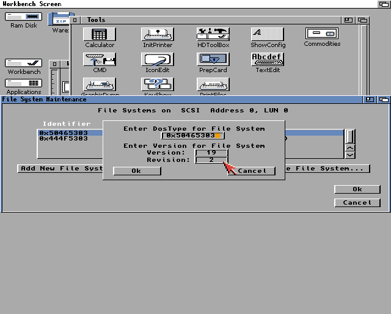
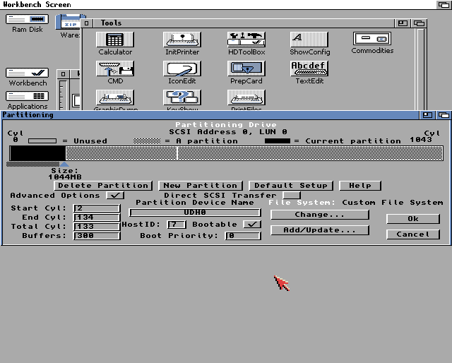
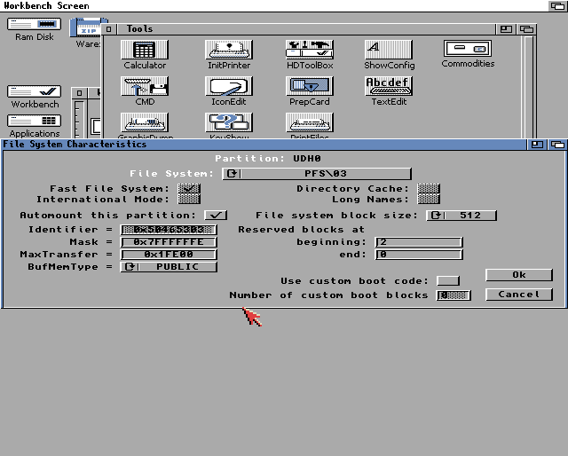

## PFS

[PFS3 All-In-One][pfs-aio], il migliore filesystem per Amiga.  
[Aminet][aminet]: [disk/misc/pfs3aio.lha][pfs-aminet]

### Impostazioni di `HDToolbox`

Iserire un nuovo filesystem

ID del Filesystem:

    0x50465303

Impostazioni della partizione:

- Buffers: `300`

- MaxTransfer: `0x1FE00`, importante solo per Amiga 600/1200



[aminet]: https://aminet.net
[pfs-aminet]: http://aminet.net/package/disk/misc/pfs3aio
[pfs-aio]: https://github.com/tonioni/pfs3aio
